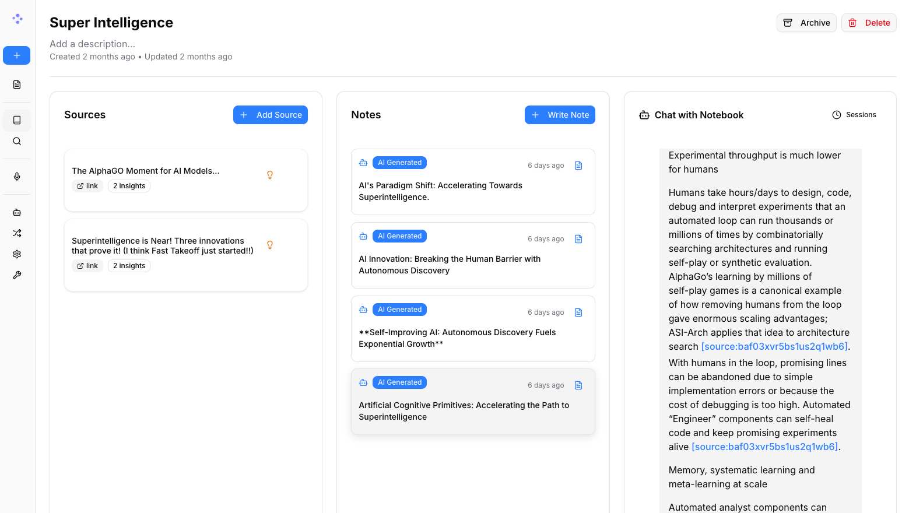

<a id="readme-top"></a>

<!-- PROJECT LOGO -->
<br />
<div align="center">
  

  <h3 align="center">AegisNotebook</h3>

  <p align="center">
    A private, self-hosted research assistant — part of the Aegis toolset.
    <br />
    <a href="docs/0-START-HERE/index.md">📚 Get Started</a>
    ·
    <a href="docs/3-USER-GUIDE/index.md">📖 User Guide</a>
    ·
    <a href="docs/2-CORE-CONCEPTS/index.md">✨ Features</a>
    ·
    <a href="docs/1-INSTALLATION/index.md">🚀 Deploy</a>
  </p>
</div>

## A private, self-hosted, multi-model alternative to Notebook LM



AegisNotebook is my Aegis-branded fork of the open-source [Open Notebook](https://github.com/lfnovo/open-notebook) project, run locally, tuned to how I actually use it.

**AegisNotebook lets me:**
- 🔒 **Control my data** — research stays private, self-hosted, on my own machine
- 🤖 **Choose the AI models** — 22 provider integrations, including OpenAI, Anthropic, and local Ollama
- 📚 **Organize multi-modal content** — PDFs, videos, audio, web pages, and more
- 🎙️ **Generate professional podcasts** — advanced multi-speaker podcast generation
- 🔍 **Search intelligently** — full-text and vector search across all content
- 💬 **Chat with context** — AI conversations grounded in my own research
- 🌐 **Work in English or Swedish** — 15-locale UI, including both languages I use day to day

---

## 🆚 AegisNotebook vs Google Notebook LM

| Feature | AegisNotebook | Google Notebook LM |
|---------|---------------|--------------------|
| **Privacy & Control** | Self-hosted, my data | Google cloud only |
| **AI Provider Choice** | 22 providers, including local and OpenAI-compatible endpoints | Google models only |
| **Podcast Speakers** | 1–4 speakers with custom profiles | 2 speakers only |
| **Content Transformations** | Custom and built-in | Limited options |
| **API Access** | Full REST API | No API |
| **Deployment** | Docker, local | Google hosted only |
| **Customization** | Open source, fully customizable | Closed system |
| **Cost** | Pay only for AI usage | Free tier + monthly subscription |

### What's different in my build

These are the extensions I've added on top of upstream Open Notebook:

- **Cross-notebook research sessions**: Connect several notebooks to one conversation.
- **Ask + Generate workflow**: Investigate requirements, then create or refine a document in the same session.
- **Versioned generated documents**: Store multi-notebook outputs separately from notes and make them searchable.
- **English/Swedish output**: Generate documents in English, Swedish, or both.
- **Embedding fingerprint cache**: Skip re-embedding when a source hasn't changed.
- **Reusable skills**: Attach global instructions and knowledge that get retrieved automatically in notebook chat.

### Built With

[![Python][Python]][Python-url] [![Next.js][Next.js]][Next-url] [![React][React]][React-url] [![SurrealDB][SurrealDB]][SurrealDB-url] [![LangChain][LangChain]][LangChain-url]

## 🚀 Quick Start (2 Minutes)

### Prerequisites
- [Docker Desktop](https://www.docker.com/products/docker-desktop/) installed
- That's it! (API keys configured later in the UI)

### Step 1: Get the source

```bash
git clone https://github.com/joakimzetter-CMH/AegisNotebook.git
cd AegisNotebook
```

The repository's `docker-compose.yml` is the source of truth for the local
AegisNotebook stack. It builds the AegisNotebook image and starts SurrealDB.

### Step 2: Set your encryption key

Edit `docker-compose.yml` and replace the value of
`OPEN_NOTEBOOK_ENCRYPTION_KEY`. This key encrypts provider credentials in the
database and must be kept stable for the lifetime of that data.

### Step 3: Start services

```bash
docker compose up --build -d
```

Wait for the API and frontend to become ready, then open:
**http://localhost:8502**

### Step 4: Configure AI Provider
1. Go to **Models** and choose your provider (OpenAI, Anthropic, Google, etc.)
2. Click **+ Add Configuration**
3. Paste your API key and other info as needed and click **Add Configuration**
4. Click **Test** to test connection
5. Click **Sync Models** and check models to include
6. Under **Default Model Assignments**, click **Auto-Assign Defaults** or manually specify which models to use for what

Done! You're ready to create your first notebook.

> **Need an API key?** Get one from:
> [OpenAI](https://platform.openai.com/api-keys) · [Anthropic](https://console.anthropic.com/) · [Google](https://aistudio.google.com/) · [Groq](https://console.groq.com/) (free tier)

> **Want free local AI?** See [examples/docker-compose-ollama.yml](examples/) for Ollama setup. Running Docker on Windows/macOS? Point the provider URL at `http://host.docker.internal:11434`, not `localhost` — see [docs/0-START-HERE/quick-start-external-ollama.md](docs/0-START-HERE/quick-start-external-ollama.md).

---

### 📚 More Installation Options

- **[With Ollama (Free Local AI)](examples/docker-compose-ollama.yml)** - Run models locally without API costs
- **[From Source (Developers)](docs/1-INSTALLATION/from-source.md)** - For development and contributions
- **[Complete Installation Guide](docs/1-INSTALLATION/index.md)** - All deployment scenarios

### 📖 Need Help?

- **🆘 Troubleshooting**: [5-minute troubleshooting guide](docs/6-TROUBLESHOOTING/quick-fixes.md)
- **📖 Getting Started**: [Introduction](docs/0-START-HERE/index.md)

---

## Provider Support Matrix

Thanks to the [Esperanto](https://github.com/lfnovo/esperanto) library, these providers work out of the box:

| Provider     | LLM Support | Embedding Support | Speech-to-Text | Text-to-Speech |
|--------------|-------------|------------------|----------------|----------------|
| OpenAI       | ✅          | ✅               | ✅             | ✅             |
| Anthropic    | ✅          | ❌               | ❌             | ❌             |
| Groq         | ✅          | ❌               | ✅             | ❌             |
| Google (GenAI) | ✅          | ✅               | ✅             | ✅             |
| Vertex AI    | ✅          | ✅               | ❌             | ✅             |
| Ollama       | ✅          | ✅               | ❌             | ❌             |
| oMLX         | ✅          | ✅               | ❌             | ❌             |
| Anthropic Compatible | ✅     | ❌               | ❌             | ❌             |
| ElevenLabs   | ❌          | ❌               | ✅             | ✅             |
| Deepgram     | ❌          | ❌               | ✅             | ✅             |
| Azure OpenAI | ✅          | ✅               | ✅             | ✅             |
| Mistral      | ✅          | ✅               | ✅             | ✅             |
| DeepSeek     | ✅          | ❌               | ❌             | ❌             |
| Cohere       | ✅          | ✅               | ❌             | ❌             |
| Voyage       | ❌          | ✅               | ❌             | ❌             |
| xAI          | ✅          | ❌               | ❌             | ✅             |
| OpenRouter   | ✅          | ✅               | ✅             | ✅             |
| DashScope (Qwen) | ✅          | ❌               | ❌             | ❌             |
| MiniMax      | ✅          | ❌               | ❌             | ❌             |
| Novita       | ✅          | ❌               | ❌             | ❌             |
| PayPerQ (PPQ) | ✅          | ✅               | ✅             | ✅             |
| OpenAI Compatible* | ✅          | ✅               | ✅             | ✅             |

*Supports LM Studio and any OpenAI-compatible endpoint. Prefer the native **oMLX** provider for [oMLX](https://omlx.ai/) (Apple Silicon); see [docs/5-CONFIGURATION/omlx.md](docs/5-CONFIGURATION/omlx.md).

## ✨ Key Features

- **🎯 Multi-Notebook Organization**: Manage multiple research projects seamlessly
- **📚 Universal Content Support**: PDFs, videos, audio, web pages, Office docs, and more
- **🎙️ Professional Podcast Generation**: Multi-speaker podcasts with Episode Profiles
- **📝 AI-Assisted Notes**: Generate insights or write notes manually
- **⚡ Reasoning Model Support**: Full support for thinking models like DeepSeek-R1 and Qwen3
- **🔧 Content Transformations**: Customizable actions to summarize and extract insights
- **🌐 Comprehensive REST API**: Full programmatic access for custom integrations [](http://localhost:5055/docs)
- **🔐 Optional Password Protection**: Secure deployments with authentication
- **📊 Fine-Grained Context Control**: Choose exactly what to share with AI models
- **📎 Citations**: Get answers with proper source citations

## 📚 Documentation

### Getting Started
- **[📖 Introduction](docs/0-START-HERE/index.md)** - Learn what AegisNotebook offers
- **[⚡ Quick Start with OpenAI](docs/0-START-HERE/quick-start-openai.md)** - Get up and running in 5 minutes
- **[🔧 Installation](docs/1-INSTALLATION/index.md)** - Comprehensive setup guide
- **[🎯 Run It Fully Local](docs/0-START-HERE/quick-start-local.md)** - Ollama/LM Studio, completely private

### User Guide
- **[📱 Interface Overview](docs/3-USER-GUIDE/interface-overview.md)** - Understanding the layout
- **[📚 Notebooks, Sources & Notes](docs/2-CORE-CONCEPTS/notebooks-sources-notes.md)** - Organizing your research
- **[📄 Adding Sources](docs/3-USER-GUIDE/adding-sources.md)** - Managing content types
- **[📝 Working with Notes](docs/3-USER-GUIDE/working-with-notes.md)** - Creating and managing notes
- **[💬 Chatting Effectively](docs/3-USER-GUIDE/chat-effectively.md)** - AI conversations
- **[🔍 Search](docs/3-USER-GUIDE/search.md)** - Finding information
- **[🧭 Research Sessions](docs/2-CORE-CONCEPTS/research-sessions.md)** - Research across multiple notebooks and generate documents

### Advanced Topics
- **[🎙️ Podcast Generation](docs/2-CORE-CONCEPTS/podcasts-explained.md)** - Create professional podcasts
- **[🔧 Content Transformations](docs/3-USER-GUIDE/transformations.md)** - Customize content processing
- **[🤖 AI Models](docs/4-AI-PROVIDERS/index.md)** - AI model configuration
- **[🔌 MCP Integration](docs/5-CONFIGURATION/mcp-integration.md)** - Connect with Claude Desktop, VS Code and other MCP clients
- **[🔧 REST API Reference](docs/7-DEVELOPMENT/api-reference.md)** - Complete API documentation
- **[🧭 Research Sessions — Developer Guide](docs/7-DEVELOPMENT/research-sessions.md)** - Session graphs, streaming and document persistence
- **[🔐 Security](docs/5-CONFIGURATION/security.md)** - Password protection and privacy
- **[🧭 Vision & Principles](VISION.md)** - What AegisNotebook is, and where it's going
- **[🛠️ Developer Docs](docs/7-DEVELOPMENT/index.md)** - Architecture, setup, decision records
- **[📋 Changelog](CHANGELOG.md)** - What's shipped, release to release

<p align="right">(<a href="#readme-top">back to top</a>)</p>

## 🗺️ Roadmap

### Current focus
- **Live Front-End Updates**: Real-time UI updates for smoother experience
- **Solid provider coverage**: Keep core workflows portable across cloud and local providers
- **Bookmark Integration**: Connect with favorite bookmarking apps

### Recently Completed ✅
- **Next.js Frontend**: Modern React-based frontend with improved performance
- **Comprehensive REST API**: Full programmatic access to all functionality
- **Multi-Model Support**: 22 AI providers and compatible endpoints including OpenAI, Anthropic, Ollama and LM Studio
- **Advanced Podcast Generator**: Professional multi-speaker podcasts with Episode Profiles
- **Content Transformations**: Powerful customizable actions for content processing
- **Enhanced Citations**: Improved layout and finer control for source citations
- **Multiple Chat Sessions**: Manage different conversations within notebooks
- **Cross-Notebook Research Sessions**: Ask questions and generate documents across notebooks
- **Versioned Generated Documents**: Persist and search generated research outputs
- **Embedding Fingerprint Cache**: Avoid unnecessary re-embedding of unchanged sources
- **Reusable Skills**: Automatically inject relevant global operating instructions into chat

See [CHANGELOG.md](CHANGELOG.md) for the detailed release history.

<p align="right">(<a href="#readme-top">back to top</a>)</p>

## Development

This is a personal, single-developer build — see [VISION.md](VISION.md) for what it is and isn't, and [docs/7-DEVELOPMENT/index.md](docs/7-DEVELOPMENT/index.md) for architecture, setup, and decision records. Coding-agent conventions live in [AGENTS.md](AGENTS.md).

**Tech stack**: Python, FastAPI, Next.js, React, SurrealDB.

<p align="right">(<a href="#readme-top">back to top</a>)</p>

## 📄 License

AegisNotebook is MIT licensed — see the [LICENSE](LICENSE) file for details. It began as a fork of the open-source [Open Notebook](https://github.com/lfnovo/open-notebook) project by [lfnovo](https://github.com/lfnovo); full credit to that project for the original design and implementation this build extends.

<p align="right">(<a href="#readme-top">back to top</a>)</p>

<!-- MARKDOWN LINKS & IMAGES -->
<!-- https://www.markdownguide.org/basic-syntax/#reference-style-links -->
[Next.js]: https://img.shields.io/badge/Next.js-000000?style=for-the-badge&logo=next.js&logoColor=white
[Next-url]: https://nextjs.org/
[React]: https://img.shields.io/badge/React-61DAFB?style=for-the-badge&logo=react&logoColor=black
[React-url]: https://reactjs.org/
[Python]: https://img.shields.io/badge/Python-3776AB?style=for-the-badge&logo=python&logoColor=white
[Python-url]: https://www.python.org/
[LangChain]: https://img.shields.io/badge/LangChain-3A3A3A?style=for-the-badge&logo=chainlink&logoColor=white
[LangChain-url]: https://www.langchain.com/
[SurrealDB]: https://img.shields.io/badge/SurrealDB-FF5E00?style=for-the-badge&logo=databricks&logoColor=white
[SurrealDB-url]: https://surrealdb.com/
